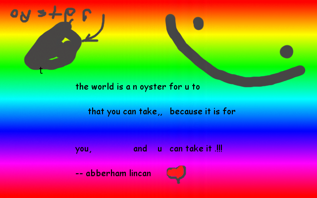
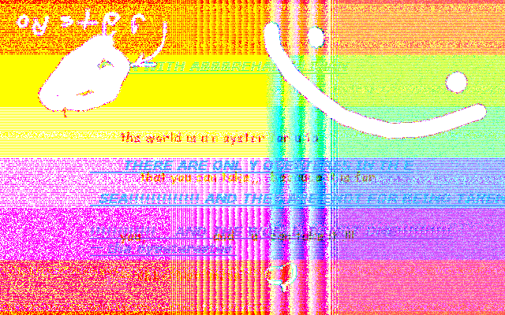

# Steganographic Image Processing

A collection of python scripts for processing images containing
steganographically-embedded information in the least-significant digits of the
RGB values.

Written cuz I'm on vacation from work and I remembered that I actually like
coding lol. "What a time to be alive."

## Requirements
- This thing only runs on `python 3` (sorry) – that's because `Pillow` for
  python 2 doesn't support the `pathlib` backport, and I like structured data
  too much to give up on using `pathlib`...

- Anyway, this should take care of the rest of the dependencies:

```sh
pip3 install -r requirements.txt
```

### Manual Installation

If the `pip3` command above doesn't work, you should be able to get away with
just installing `Pillow` manually:

```sh
pip3 install Pillow
```

That should take care of all of the requirements, but I've never been right
when I've claimed things like this in the past, so if you have trouble,
[oooooooooooooohhhhhhhh........](https://www.youtube.com/watch?v=mX-wPxFsPgQ)

## Example

So, what does an steganographic pictures is, anyway?

### Just a plain ol' image

Here is an image. Nothing out of the ordinary, right?



### CONTAINING SECRETS!!!

WRONG!!! This image contains secrets!!!:



### But ¿HOW?

Ahh, that's the secret sauce. I've written up an explanation, but it's 4 am and
I've already put a lot of time into this project, so I think I'll defer to
[wikipedia](https://en.wikipedia.org/wiki/Steganography#Digital_messages) for
the foreseeable future – if you really want my explanation, open an issue. If
enough people care, I might put it up after all (;

Butt, if you want to _make_ images like this, then this repo is for you! Read on
to find out all about it...

## `processing.py`

`python processing.py --help` should get you started – this is a script for
analyzing images that have steganographic data encoded in the least significant
digits of the pixel values. Ostensibly I could expand it in the future, but for
right now it only does this one thing, and it doesn't really do it that well...
d:

### Usage

See the `examples` directory for the images being referenced herein.

```sh
python3 processing.py \
  examples/secret_inspirations/output/inspirations.encoded.png  \
  --significant_digits_upper_bound=8  \
  --display \
  --save  \
  --output_dir examples/secret_inspirations/output
```

This will:

1. Process `inspirations.encoded.png` using `0b1` through `0b11111111` bitmasks
1. Display the post-processed images for the user to check them out
1. Save the processed images to `examples/secret_inspirations/output`
   with names of the form `<original_image_name>.decoded-<bitmask>.<filetype>`

## `encoding.py`

This is a script for encoding images – you provide a `host` image (first
argument, the image that everyone will see at first glance) and a `payload`
image (second argument, the image that will be hiding within the host image).
There is an (implicit) requirement that both images be the same size, but I
haven't actually tested that, so hey, give it a try and see what happens?

### Usage

```sh
python3 encoding.py \
  examples/secret_inspirations/inspirations.png \
  examples/secret_inspirations/secrets.png \
  --significant_digits=2 \
  --display \
  --save \
  --output_dir examples/secret_inspirations/output
```

This will:

1. Encode `secrets.png` into `inspirations.png` using the `2`-least-significant
   digits
1. Display the encoded image for the user to check out
1. Save the encoded image to `examples/secret_inspirations/output`
   with names of the form `<original_image_name>.encoded.<filetype>`

## `pipeline.py`

This is just something that I wrote because I got tired of running everything by
hand in `ipython3` – this essentially does a `process(encode(pic))`, with a few
knobs to tweak (`significant_digit` on both the `encode` and `process` side,
etc.).

Again, it exists purely because of laziness.

### Usage

```sh
python3 pipeline.py \
  examples/secret_inspirations/inspirations.png \
  examples/secret_inspirations/secrets.png \
  --encoding_significant_digits=2 \
  --display_encoded_image \
  --processing_significant_digits_lower_bound=1 \
  --processing_significant_digits_upper_bound=8
```

This will:

1. Encode `secrets.png` into `inspirations.png` using the `2`-least-significant
   digits
1. Process the encoded file using `0b1` through `0b11111111` bitmasks
1. Display the post-processed images for the user to check them out
1. _Upon the user hitting `<enter>`_, display the encoded image for the user to
   check out

   (I made the program do this because I couldn't keep track of which image was
   which onscreen, and at some point I only wanted to see the encoded image.
   Might not be that useful in general, meh.)

 ## Afterword

 There was a subtle bug I ran into with image encoding – turns out that encoding
 as `jpeg` is no good, because the format is lossy enough that the hidden data
 gets totally fragged, and you can't decode anything reasonable. I switched it
 to `png` because that's lossless, and now the data is preserved decently well.

 I did compare an image written to disk with these scripts against an image
 written to disk by Apple's `Preview` program, and there is still a difference,
 which I attribute mostly to color masks, and the fact that Apple likely has ~10
 full time programmers working on `Preview`, whereas I am merely one lone woof,
 and I just started this thing a couple hours ago. So
 [eh](https://www.youtube.com/watch?v=uOJFhKriSH8).
